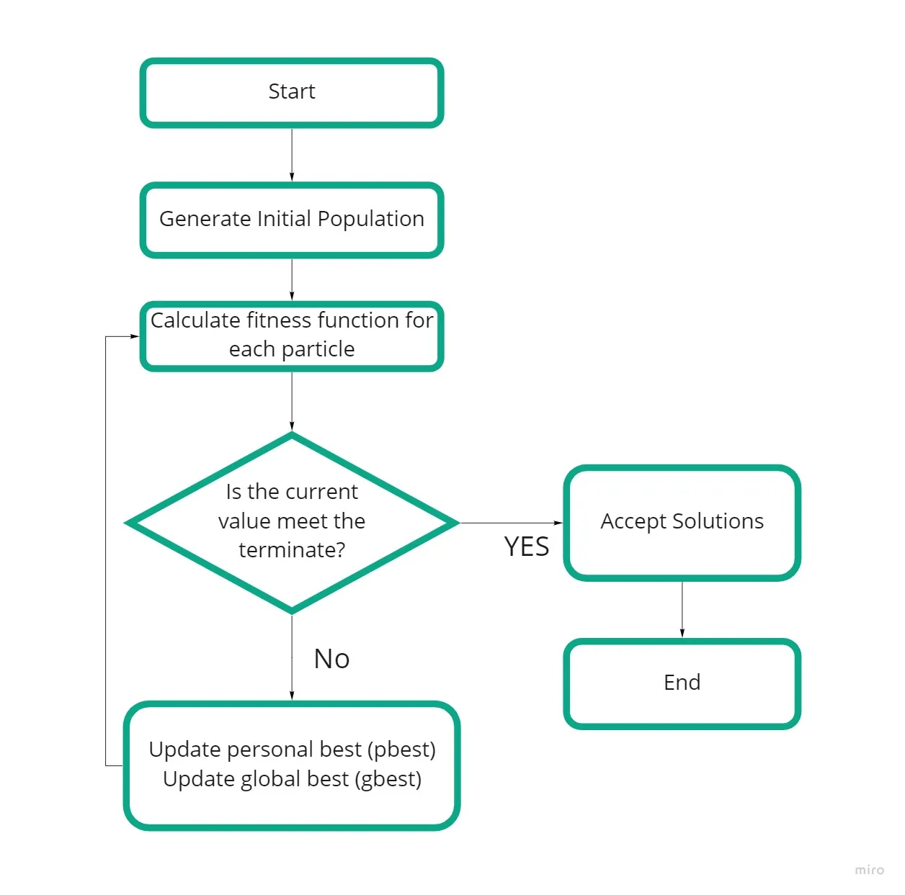

# Parallel-and-distributed-implementation-of-PSO
## PSO: Particle Swarm Optimization
PSO is best used to find the maximum or minimum of a function defined on a multidimensional vector space. Assume we have a function F(X) that produces a real value from a vector parameter (X, Y) (such as coordinate in a plane) and X can take on virtually any value in the space. The PSO algorithm will return the parameter which produces the minimum value of the function.
### 1.PSO is a stochastic optimization technique based on the movement and intelligence of swarms.
### 2.In PSO, the concept of social interaction is used for solving a problem.
### 3.It uses a number of particles (agents) that constitute a swarm moving around in the search space, looking for the best solution.
### 4.Below is a flow diagram of PSO 

## Types of Particle Swarm Optimization
PSO algorithms can be of different types, even simple ones. The particles and velocities can be initiated in different ways. Update the Swarm and then set values for Pi and G and so on.

### Gradient Particle Swarm Optimization — We can construct gradient-based PSOs by combining the efficiency of the PSO at exploring many local minimums with the gradient-based local search algorithms. This helps us to accurately calculate a local minimum.
### Hybrid Particle Swarm Optimization — To increase and make the optimization process better, newer and more advanced types of PSO variations are being tested and used and are an ongoing field of study. A Hybrid PSO is where a normal PSO is combined with another optimization technique which helps to make it better.

## Implementing PSO with JAVA  
